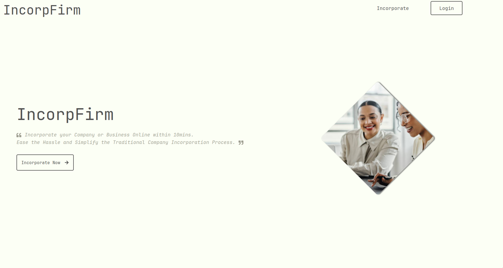
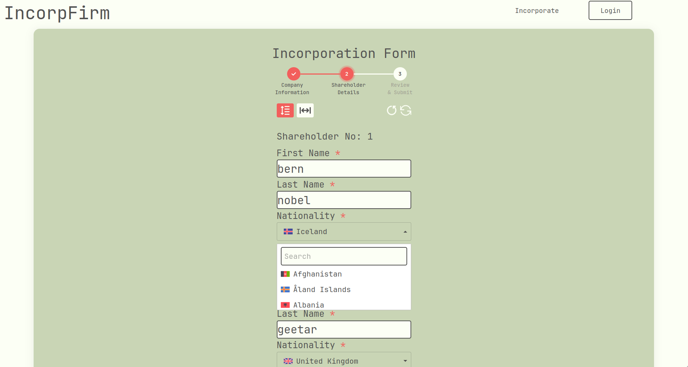
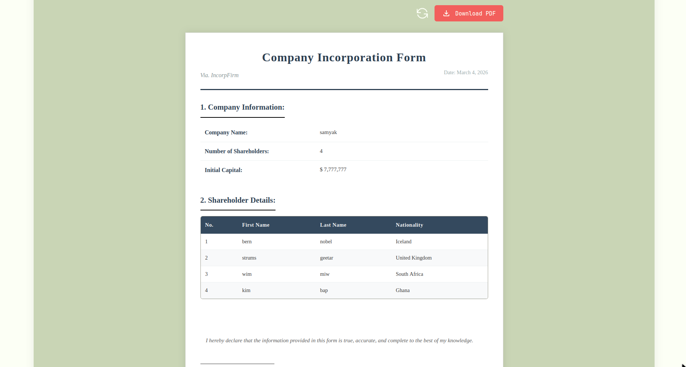
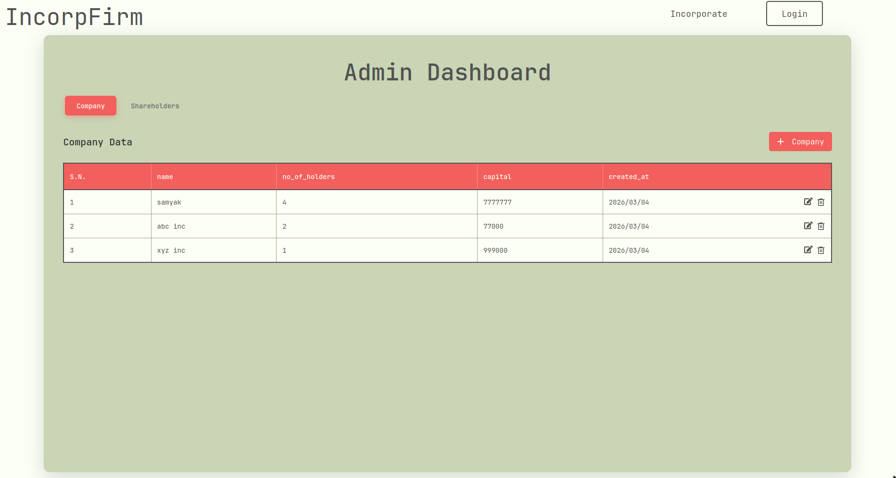
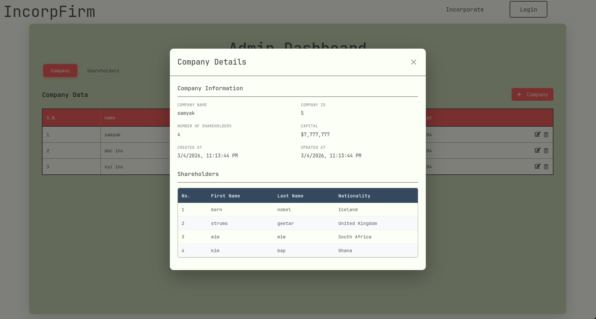
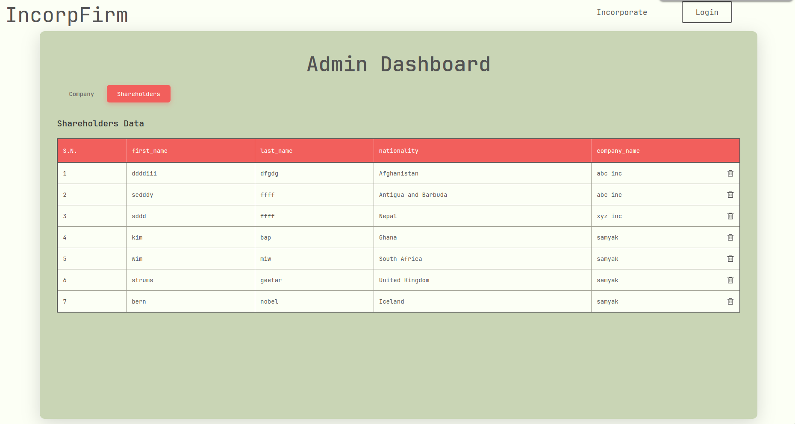

# Company Incorporation Tool

A full-stack web application that streamlines the company incorporation process, guiding users through each step from business name registration to document generation.

---

## Table of Contents

- [Tech Stack](#tech-stack)
- [Prerequisites](#prerequisites)
- [Installation](#installation)
- [Environment Setup](#environment-setup)
- [Running the Application](#running-the-application)
- [Website Showcase](#website-showcase)

---

## Tech Stack

- **Frontend:** React (Vite) 
- **Backend:** Node.js / Express
- **Database:** PostgreSQL

---


## Prerequisites

Ensure you have the following installed:
- [Node.js](https://nodejs.org/) (v18+)
- [PostgreSQL](https://www.postgresql.org/)
- npm

## Installation

Clone the repository:

```bash
git clone git@github.com:Samyak0-0/Company-Incorporation-Tool.git
cd Company-Incorporation-Tool
```

## Environment Setup

Navigate to the backend directory and create your environment file:

```bash
cd backend
mv .env.example .env
```

Open `.env` and update your PostgreSQL credentials:

```env
DB_PASSWORD=your_postgresql_password
```

## Running the Application

**1. Install the Dependencies and Start the backend server**

```bash
cd backend
npm i
npm start
```

> The API will be available at `http://localhost:3000/api/`

**2. In a new terminal, install the Dependencies and Start the frontend**

```bash
cd frontend
npm i
npm run dev
```

> The app will be available at `http://localhost:5173`

---

## 🖼 Website Showcase

<table>
  <tr>
    <td></td>
    <td></td>
  </tr>
  <tr>
    <td></td>
    <td></td>
  </tr>
  <tr>
    <td></td>
    <td></td>
  </tr>
</table>

> Screenshots are stored in [`docs/images/`](docs/images/)

